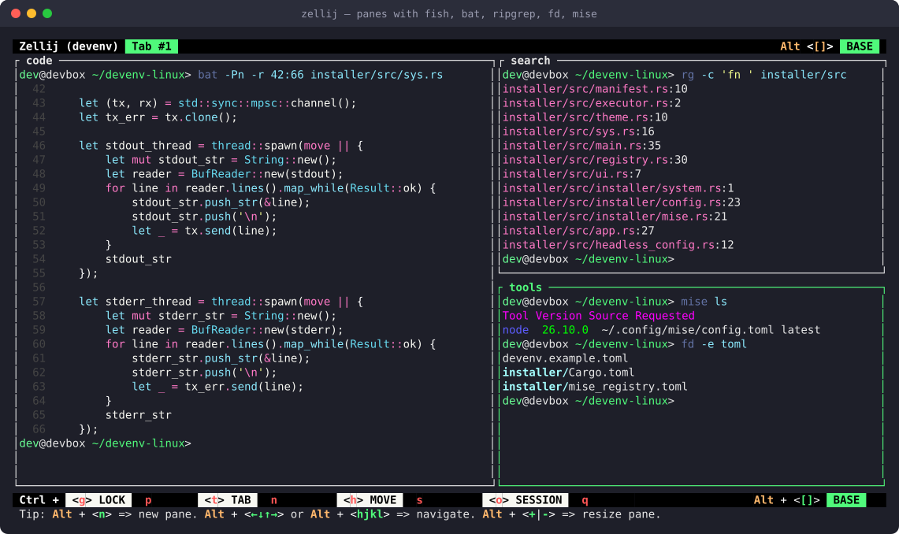
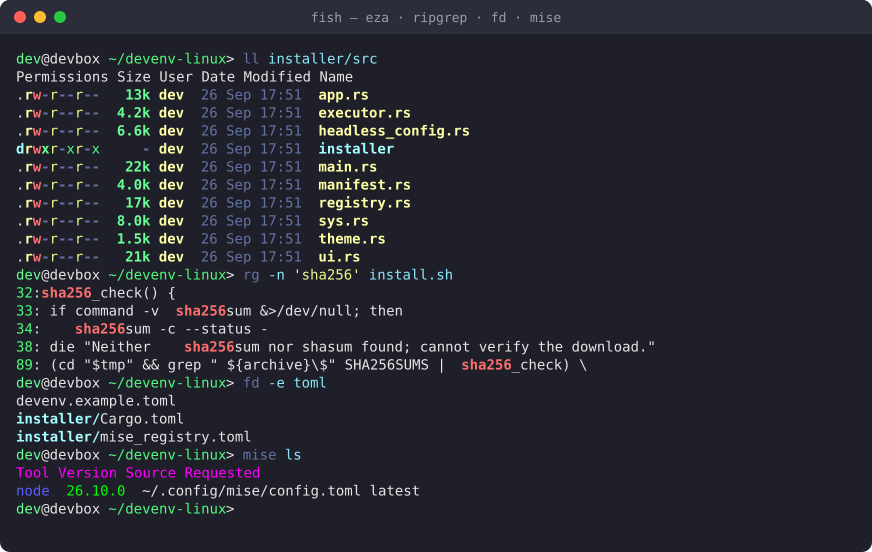
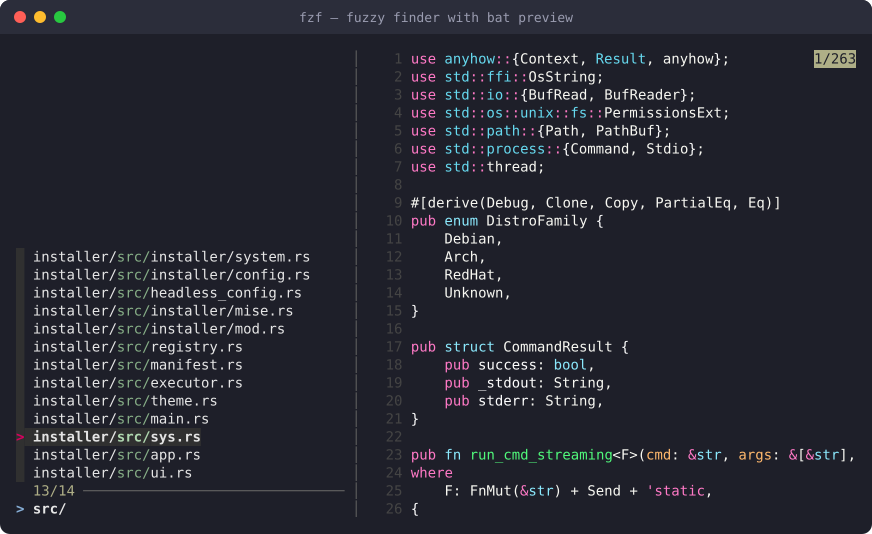

# devenv-linux

**One command turns a fresh Linux machine into a ready-to-code terminal setup.**
Pick what you want in a small TUI: Fish, Neovim with LazyVim, Rust, Node.js,
Go, Python (uv), modern CLI tools, and Zellij. Tools are installed with
[mise](https://mise.jdx.dev), so they live in your home directory and are easy
to update or remove.

<p align="center">
  
</p>

## Quick start

```bash
curl -fsSL https://raw.githubusercontent.com/nguyenvulong/devenv-linux/main/install.sh | DEVENV_VERSION=v1.1.1 bash
```

Choose components with <kbd>Space</kbd>, press <kbd>Enter</kbd> to review, then
<kbd>Enter</kbd> again to install. Open a new shell when it finishes.

- Works on Ubuntu 24.04, Debian 13, Fedora 43, and Arch Linux (x86_64 and aarch64).
- Nothing changes until you confirm. Existing configs are backed up first.
- The script checks the release checksum before running anything. Leave out
  `DEVENV_VERSION` to get the latest release.

## What you get

| Category | Included |
|---|---|
| **Shells** | Fish with aliases and colors, mise activation for Bash and Fish |
| **Editor** | Neovim with the LazyVim starter and OSC 52 clipboard over SSH |
| **Languages** | Rust, Node.js, Go, Python via uv |
| **CLI tools** | ripgrep, fd, fzf, bat, eza, glow, jaq, Zellij |
| **Anything else** | Press <kbd>/</kbd> in the installer to add any tool from the mise registry |

**Zellij** with Fish in every pane: `bat`, `ripgrep`, `fd`, and `mise` side by side.



**Fish** with the bundled aliases: `ll` is `eza`, plus `ripgrep`, `fd`, and `mise ls`.



**fzf** with a `bat` preview for finding files fast.



## Non-interactive installs

Arguments after `bash -s --` are passed to the installer.

```bash
# Everything, e.g. for a new VM, container image, or CI runner
curl -fsSL https://raw.githubusercontent.com/nguyenvulong/devenv-linux/main/install.sh | bash -s -- --all

# Only the components enabled in a config file
curl -fsSL https://raw.githubusercontent.com/nguyenvulong/devenv-linux/main/install.sh | bash -s -- --config devenv.toml
```

Copy [`devenv.example.toml`](devenv.example.toml) to start a config. It lists
every component; set `enabled = true` on the ones you want. Mise tools can pin
a `version`:

```toml
[[components]]
id = "rust"
enabled = true
version = "1.85.0"
```

Run `devenv --help` for all options.

## License

MIT
